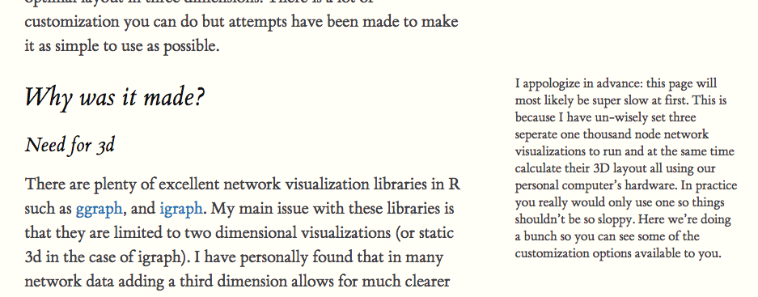

# brandondey.github.io

### Resources
1. [blogdown](https://github.com/rstudio/blogdown/blob/master/docs/01-introduction.Rmd)
2. [R Markdown](https://rmarkdown.rstudio.com/authoring_basics.html)
3. [R Markdown Websites](https://rmarkdown.rstudio.com/rmarkdown_websites.html)
4. [LaTeX Templates for CV's, aticles, and pretty much everything.](https://www.latextemplates.com/)

### Features to consider adding
* `DT::datatable(iris)` creates interactive data tables in .Rmd.
* Soliloquey type comments in the margin, eg. 

#### Inspiring Blogs
* Like the technical walk-through: http://livefreeordichotomize.com/2018/02/12/the-united-states-of-seasons/
* Terrific tutorial: https://jennybc.github.io/purrr-tutorial/bk01_base-functions.html
* Similar post? 
  - http://livefreeordichotomize.com/2017/08/14/why-you-maybe-shouldnt-care-about-that-p-value./
  - http://ddar.datavis.ca/pages/extra/titanic-glm-ex.pdf

#### Inspiring Resumes
* http://www.lucymcgowan.com/html-cv/live-cv.html
# brandondey.github.io
